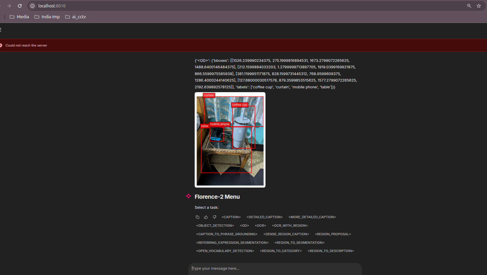
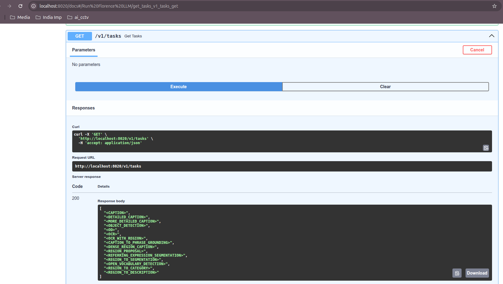
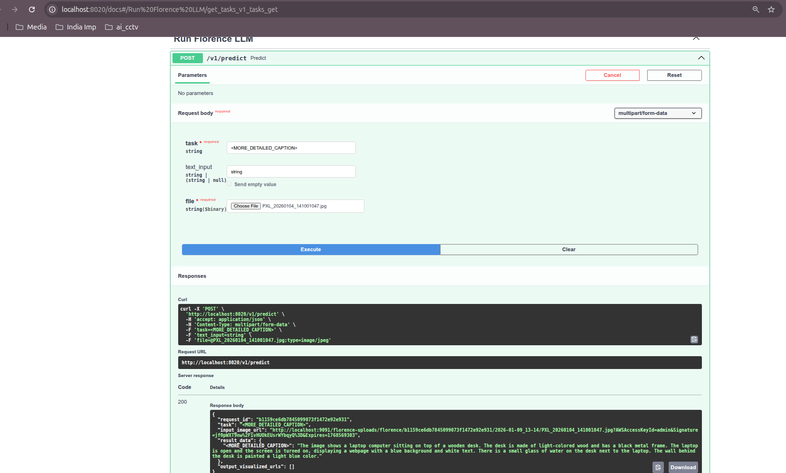

# FastAPI Wrapper for Microsoft Florence-2

A high-performance, production-ready wrapper for Microsoft's Florence-2 Vision-Language Model. This project provides both a FastAPI backend for programmatic access and a Chainlit frontend for interactive chat, integrated with Infisical for secrets, MinIO for storage, and Logfire for observability.

## 🛠 Prerequisites

Before running this project, ensure you have the core infrastructure running. This project relies on the following services:

1. Infisical: For secret management.
2. MinIO: For storing uploaded and processed images. To eliminate the need to write custom clean up scripts
3. Logfire: For structured logging and monitoring. Create a free [Logfire](https://pydantic.dev/logfire) account and select the free plan. The [free plan](https://pydantic.dev/pricing) is very generous for localhost project. They give 10M span AKA logs. If you have ever used Grafana or Humio, you will find almost all the developer needful features in here


<mark>[!IMPORTANT]</mark> For detailed instructions on setting up Infisical and MinIO, please refer to the [Infisical-Minio](https://github.com/rb1811/infra-monitoring) project. You will need to obtain your Machine Identity credentials there.

<mark>[!IMPORTANT]</mark> Create a project in Logfire, generate a write token and copy it to `.env` in `LOGFIRE_TOKEN`

## 📥 Local Model Preparation

To ensure fast startup and offline capability, the Florence-2 model must be downloaded locally before building the Docker containers.

1. Create a local folder:
    ```
    mkdir -p hf_cache/florence-2-large
    ```
2. Download the model files from HuggingFace. [Click here for Local Florence Installation instructions](./Local%20Florence%20Installation.md)

### Why you need MS Florence locally?
**Ans**: It speeds up boot time for the docker container. Else it tries to download the LLM after the chainlit server starts. 

3. Ensure the folder structure looks like this:
```
project_root/
├── api/
├── app/
├── .vscode/
├── hf_cache/
│   └── florence-2-large/
│       ├── config.json
│       ├── model.safetensors
│       ├── tokenizer.json
│       └── ... (other model files)
└── ... other files
```

## ⚙️ Configuration (.env)

Create a .env file in the root directory. Use the following template:

```
# Ports
CHAINLIT_PORT=8010
FASTAPI_PORT=8020

# --- INFISICAL MACHINE IDENTITY ---
# Refer to https://github.com/rb1811/infra-monitoring for setup
INFISICAL_PROJECT_ID=your_project_id
INFISICAL_MACHINE_ID=your_machine_id
INFISICAL_MACHINE_SECRET=your_machine_secret

# --- OBSERVABILITY ---
# Set DEV_MODE=true to disable Logfire during local testing
LOGFIRE_TOKEN=your_logfire_write_token
DEV_MODE=false
LOG_LEVEL=DEBUG

# --- MODEL ---
MODEL_ID=/app/hf_cache/florence-2-large
SERVICE_NAME=florence-ai
```

## 🐳 Docker Build Strategy

This project uses a Two-Stage Docker Build to maximize efficiency. By separating the heavy AI dependencies from the application code, we save time and data during rebuilds.

Step 1: Build the Base Image
This contains all the "heavy" dependencies like PyTorch, Transformers, and CUDA libraries. You have 2 options for this.

1. **Via CLI**: 
    ```
    docker build -f Dockerfile.base -t florence-base:latest .
    ```
2. **Via VS Code** (ctrl+shift+p: Run Task): Run the task "Florence: Build Base Image" from [vscode tasks](./.vscode/tasks.json)

Step 2: Build the Application Image
This adds your code on top of the base image.

1. **Via CLI**:
    ```
    docker build -t florence_ai:latest .
    ```


## 🚀 Usage

Once the containers are up, you can access the Florence model through two interfaces:

| Interface  | URL                           | Description                                                  |
| ---------- | ----------------------------- | ------------------------------------------------------------ |
| _FastAPI_  | `http://localhost:8020`       | Rest API for programmatic inference and /predict endpoints   |
| _Chainlit_ | `http://localhost:8010`       | User-friendly chat interface for interactive image analysis. |

## Storage Management

All images (input and output) are automatically synced to your MinIO instance. This ensures that your local Docker container remains stateless and images are persisted safely.

## 📈 Monitoring & Logging

This project is integrated with Pydantic Logfire.

1. Production Mode (DEV_MODE=false): All logs and traces are sent to your Logfire dashboard. You must provide a valid LOGFIRE_TOKEN in .env.
       Chainlit is run as background process and FastAPI is run as a PID 1 process.
2. Development Mode (DEV_MODE=true): Logfire is disabled, and logs are output to the standard console for easier local debugging.
       Neither Chainlit or FastAPI is run by default. Its left upto the developer to chose which they want to run. Commands are available in enterypoint.sh. Or you can run them using tasks available in .vscode/tasks.json

## 📜 Credits & References

This project is built upon the excellent foundation provided by the original MS-Florence2 implementation. Special thanks to the original authors:

[Original implementation](https://github.com/askaresh/MS-Florence2/tree/main/app)


## 🚀 Key Enhancement: Universal Hardware Support (CPU & GPU)

Unlike the [original implementation](https://github.com/askaresh/MS-Florence2/tree/main/app) which was strictly optimized for NVIDIA GPUs via CUDA, this wrapper is designed to be hardware-agnostic. 

- **CPU Support**: By utilizing a `Python 3.11` base image and explicitly configuring the model to use `torch.device("cpu")`, this project can run on any standard PC, laptop, or server without a dedicated GPU.
- **Portability**: This makes the project ideal for local development, CI/CD pipelines, and cost-effective cloud deployments where expensive GPU instances aren't required.

## Demo Screenshots
| Output Image | Description | 
| :---: | :---: |
|  | Florence via Chainlit. Task <OD> short for Object Detection |
|  | FastAPI /v1/tasks to get all tasks supported |
|  |  FastAPI /v1/predict Task <MORE_DETAIL_CAPTION>|


### Checkout [All Florence Tasks Details @](chainlit.md)


## High Level Architecture Diagram

